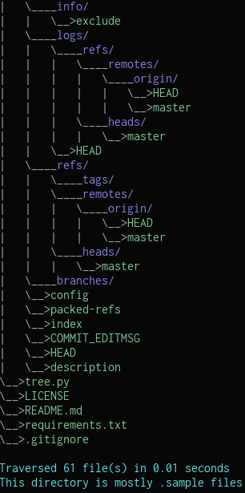

<h1 align="center">Tree</h1>

<p align="center">
<a href="https://github.com/Alex0Blackwell/tree">

</a>
</p>

<p align="center">
  <a href="#overview">Overview</a>
  &nbsp;&nbsp;&nbsp;|&nbsp;&nbsp;&nbsp;
  <a href="#examples">Examples</a>
  &nbsp;&nbsp;&nbsp;|&nbsp;&nbsp;&nbsp;
  <a href="#technologies">Technologies</a>
  &nbsp;&nbsp;&nbsp;|&nbsp;&nbsp;&nbsp;
  <a href="#installation">Installation</a>
  &nbsp;&nbsp;&nbsp;|&nbsp;&nbsp;&nbsp;
  <a href="#usage">Usage</a>
</p>

## Overview
Visualize the current working directory's file structure. Hidden files are not shown by default, however, hidden files can be shown if specified via the **-a** flag.

## Examples

> A portion of the file structure of this repository, including hidden files

<p align="center">
<a href="https://github.com/Alex0Blackwell/tree">

</a>
</p>

## Technologies

- **Python**
- **Termcolor** and **Colorama**
  - For adding colored text to the terminal

## Installation

```bash
# clone the repo
$ git clone https://github.com/Alex0Blackwell/tree.git

# change the working directory to tree
$ cd tree

# install python3 and python3-pip if they are not installed

# install the requirements
$ python3 -m pip install -r requirements.txt
```
### Run the script from any directory (in Linux)
This script needs to be able to run from any directory. Otherwise it will only be able to display the file structure of the repository itself.  

#### Step 1: Make the Python file executable

```
chmod +x tree.py
```

#### Step 2: Move the file to bin
cp tree.py /bin/tree

#### That's it!
Now you can use the program in any directory!


## Usage

```
$ tree
usage: tree

tree: displays file structure (Version 0.0.1)

arguments:
  -h, --help            Show this help message and exit
  -a, --all             Include hidden files in tree visualization
```

To display the file structure, including hidden files, in the current directory:
```
tree -a
```

## License

Licensed under the [MIT License](LICENSE).
